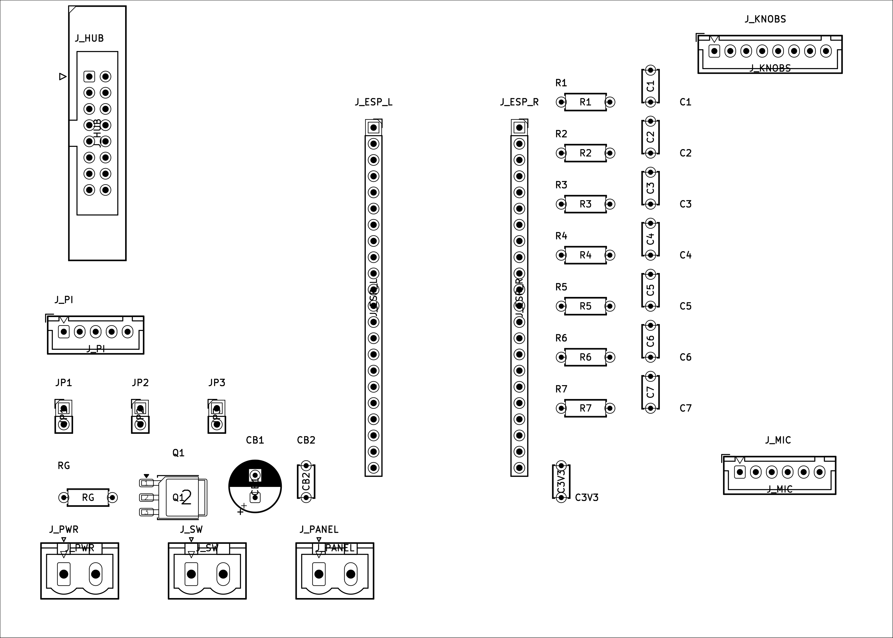

# Assembly

Order: fab the PCBs → solder them → make the cables → wire power → bench test with
nothing seated → seat the boards → mount in the enclosure.

## 1. Order the PCBs

Upload each zip to jlcpcb.com. Every board is a plain 2-layer through-hole board: no
controlled impedance, no blind vias, nothing under 0.35 mm. Defaults are fine except
the size, which JLC reads from the Gerbers anyway.

| Board | File | Size | Copper |
|---|---|---|---|
| Carrier | `hardware/carrier-board/carrier-board-jlc.zip` | 140 × 100 mm | **1 oz** (the 5 V traces are 4 mm wide, sized for 1 oz at 6 A) |
| Knob | `hardware/knob-board/knob-board-jlc.zip` | 100 × 30 mm | 1 oz |
| Mic | `hardware/mic-board/mic-board-jlc.zip` | 20 × 38 mm | 1 oz |

Order bare boards, no assembly. All three passed JLC's DFM check with zero Danger
findings. To regenerate a zip from source you need `kicad-cli` (KiCad 9/10) plus the
stock symbol and footprint libraries; `make zip` in each board directory runs ERC + DRC
first and refuses to build from a board with violations.

## Where the parts go

Every board directory has an `assembly/` folder with placement drawings and renders,
regenerated from the KiCad files by `hardware/render-assembly.sh`:

| File | What |
|---|---|
| `placement-top.png`, `placement-bottom.png` | Outline + footprint outlines + reference designators, as you look at that side (bottom is mirrored) |
| `placement.pdf` | The same, one page per layer, printable |
| `render-top.png`, `render-bottom.png` | 3D render of the bare board with silkscreen |

Carrier board, top:



## 2. Solder the carrier board

Order of operations: shortest parts first. Resistors and ceramics, then Q1, then CB1,
then the headers and sockets, then the screw terminals and JST connectors, then the IDC
header.

- **Q1 (AOD403, DPAK)** is the only surface-mount part. Tin the tab pad, place, reflow
  the tab with a broad tip, then the two legs. Orientation: the silk shows the outline
  and pin 1.
- **CB1 (470 µF)** is polarized. The silk has a hatched band on the negative side.
- **J_ESP_L / J_ESP_R sockets**: plug the ESP32-S3 devkit into both sockets *before*
  soldering them so they end up parallel, then solder with the devkit as the jig. Row
  spacing is 22.86 mm; if your devkit does not drop in freely it is the wrong (1.0")
  board, see the BOM.
- **J_HUB (IDC 2×8)**: key notch faces the board edge, matching the ribbon's key. Pin 1
  is marked on the silk.
- **JST connectors**: shroud opening (pin 1 mark) as silk-screened.
- Fit **shunts on JP1, JP2, JP3** for normal operation. See §5 for when to pull them.

Nets and connector pinouts are in `hardware/carrier-board/generator/gen_carrier_sch.py`
(the schematic is generated from that file, so the file is the readable version).

## 3. Solder the knob board

- The three EC11 encoders go on the **top** side, J1, R1 and R2 on the **bottom**. The
  encoders' shield lugs solder to the ground pour.
- The switch ladder is on this board: ENC1 (MODE) switch direct to ground, ENC2 (BRIGHT)
  through R1 3.3 kΩ, ENC3 (GAIN) through R2 10 kΩ. The 10 kΩ pull-up and 100 nF
  debounce for that node live on the carrier, which is why the cable has no 3.3 V line.
- The bare board carries no MODE / BRIGHT / GAIN legend; that goes on the front panel.

**This board is the front-panel drilling template.** Knob shafts are on **38 mm centres**,
symmetric, 12 mm from each end of the 100 mm board, and 5 mm above the board's vertical
centreline. Clamp the bare board to the panel and spot the three holes through it, then
drill for the EC11's threaded bushing (7 mm thread; drill 7.2 mm).

## 4. Solder the mic board

Solder the two 1×3 headers and the JST. Mount the INMP441 module on the headers with its
**label / sound-port side up**, chip side toward the board. The Ø3 mm centre hole is
acoustic relief so either orientation still hears, but port-up makes the silk labels
match the module's. L/R is tied to ground on this board (left channel), which is what
the firmware expects. Two M3 holes, 14 mm apart, at the top corners.

## 5. Power and connector map

```
wall → 5 V brick → panel-mount DC jack → J_PWR (VIN_RAW)
                                          │
                        J_SW ─ master toggle ─┘ (VIN_SW)
                                          │
                                   Q1 AOD403 (reverse-polarity)
                                          │ P5V
              ┌───────────────┬───────────┼─────────────┐
           J_PANEL           JP1         JP2 + JP3    (P3V3 comes back
        panel own thick   ESP32 5V pin   Pi pins 2, 4   from the devkit's
        power pigtail                    via J_PI       regulator)
```

| Connector | Pin | Net | Goes to |
|---|---|---|---|
| J_PWR | 1, 2 | VIN_RAW, GND | DC jack + and − |
| J_SW | 1, 2 | VIN_RAW, VIN_SW | The master toggle's two lugs (the toggle breaks the + rail) |
| J_PANEL | 1, 2 | P5V, GND | Panel power pigtail (red, black) |
| JP1 | | P5V → ESP_5V | Shunt = carrier powers the devkit |
| JP2, JP3 | | P5V → PI_5V_A / B | Shunts = carrier powers the Pi (two shunts so each carries ≤1.5 A) |
| J_HUB | 1–16 | HUB75 | Panel ribbon, straight |
| J_KNOBS | 1–8 | MODE_A, MODE_B, BRIGHT_A, BRIGHT_B, GAIN_A, GAIN_B, SW_LADDER, GND | Knob board J1, 1:1 |
| J_MIC | 1–6 | MIC_SCK, MIC_WS, MIC_SD, GND, P3V3, GND | Mic board J1, 1:1 |
| J_PI | 1–5 | PI_5V_A, PI_5V_B, GND, UART_RX, UART_TX | Pi header **pins 2, 4, 6, 8, 10** in that order |

The Pi cable is deliberately straight: J_PI pin 4 (ESP32 RX, GPIO 17) lands on Pi pin 8
(TXD) and pin 5 (ESP32 TX, GPIO 18) on Pi pin 10 (RXD). The crossover is on the carrier.
Both sides are 3.3 V, no level shifter. 115200 8N1.

**Pull JP1 whenever a USB cable is plugged into the ESP32 devkit** while the carrier is
powered. The devkit has no reverse-current protection on USB VBUS; a live 5 V pin plus a
USB cable back-feeds your computer's port. Flash it with JP1 out (the devkit runs from
USB), then put the shunt back. JP2/JP3 out isolates the Pi the same way; pulling one of
them is also where you put an ammeter to measure Pi + screen current.

ESP32-S3 GPIO map, for reference (it is fixed by the firmware, not by this board):

| Function | GPIO | | Function | GPIO |
|---|---|---|---|---|
| HUB75 R1 G1 B1 | 4 5 6 | | Mic SCK WS SD | 38 39 40 |
| HUB75 R2 G2 B2 | 7 15 16 | | MODE A / B | 47 / 48 |
| HUB75 A B C D | 8 9 10 11 | | BRIGHT A / B | 1 / 12 |
| HUB75 LAT OE CLK | 13 14 21 | | GAIN A / B | 41 / 42 |
| UART RX / TX | 17 / 18 | | Switch ladder (ADC1) | 2 |

There are **no spare GPIOs**. Adding anything means removing something.

## 6. Bench test before seating anything

1. Nothing in the sockets, no Pi, no panel. Plug in the brick, toggle on. Measure 5 V at
   J_PANEL and across JP1, JP2, JP3. Reverse the brick's polarity if you can and confirm
   nothing gets warm: Q1 should block.
2. Toggle off. Plug the panel ribbon into J_HUB and the panel pigtail into J_PANEL.
3. Seat the ESP32-S3 (already flashed and provisioned, see
   [`board1-firmware.md`](board1-firmware.md)). Shunt on JP1. Toggle on: the panel should
   come up with the Mountain spectrum within a few seconds.
4. Plug in the mic and knob cables. Speak: the spectrum should react. Turn the knobs.
5. Toggle off. Connect the Pi cable to header pins 2, 4, 6, 8, 10, shunts on JP2/JP3,
   screen on HDMI + USB. Toggle on. The Pi boots into the display app
   ([`board2-display.md`](board2-display.md)).

## 7. Enclosure

- Displays inset into the top of the body, control cavity routed from the rear, the DC
  jack on the rim through a jack plate. The brick stays outside: **no mains inside the
  wood**.
- Diffuser stack, front to back: Black LED acrylic → P95 Lighting White 69 % → ~5 mm air
  gap on nylon standoffs → the panel. Run the panel brighter to compensate. A black
  egg-crate grid in the air gap, one cell per LED, turns the soft glow into crisp
  Pixoo-style squares if you prefer that look.
- Mount the mic board where it hears the room, away from the Pi, with the port facing
  out through a small hole. Keep it off the panel's power leg.
- Passive cooling only. Any fan will be in the audio.
- The master toggle is a hard power cut. Make the Pi safe for that (read-only root or
  USB boot) before you close the box.
